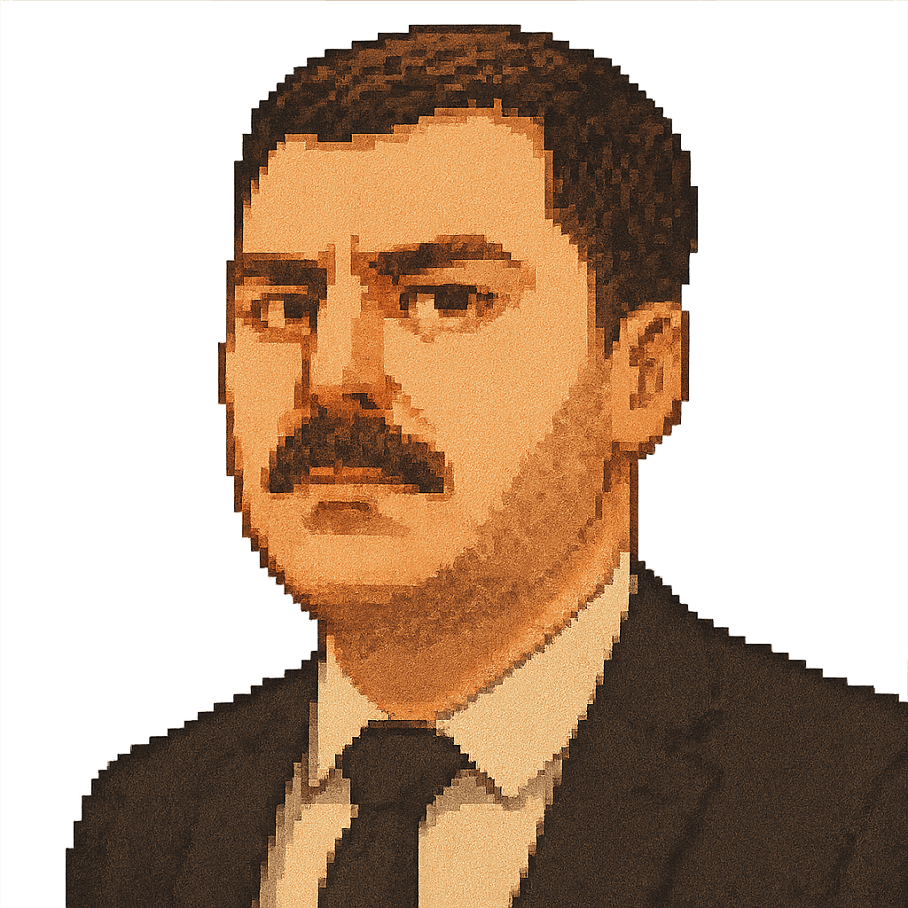
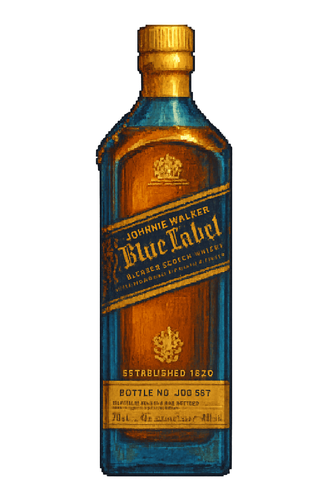

# 3JMS Liquor Store Game

<p align="center">
  
</p>

Welcome to the 3JMS Liquor Store! You're the clerk at this bustling pixel-art establishment. Customers will come in with various requests, from specific bottles to drink ingredients. Can you serve them all before time runs out?

## Gameplay

Test your speed and knowledge of spirits!

1.  **Customer Arrives:** A customer walks in (with style!) and presents their request in a dialogue bubble.
2.  **Find the Bottle(s):** Scan the shelf on the right for the item(s) they need. The requests get trickier as you progress!
3.  **Select & Confirm:** Click the correct bottle. Once selected, click the "Confirm Selection" button at the bottom.
4.  **Success/Failure:**
    *   **Correct:** The customer thanks you and leaves. The next customer arrives, and your score increases!
    *   **Incorrect / Time Out:** Game Over! You'll see who you disappointed (or Amel, if time ran out) and your final score.
5.  **Victory:** Serve all customers successfully to win the game!

## Features

-   Classic pixel art aesthetic
-   Engaging timer-based gameplay
-   Increasing difficulty across multiple request types (by name, type, drink recipe)
-   Unique customer dialogues and failure messages
-   Responsive design for desktop and mobile play
-   Catchy customer audio (dialogue, success, failure)

## Meet Some Customers

<p float="left">
  
   
  
  
</p>

*...and many more!* Each with their own unique request and personality.

## Stocked Bottles (Examples)

<p float="left">
  
   
  
  
</p>

*Whisky, Gin, Tequila, Vodka, Rum, Bourbon, Wine, Beer, and more!*

## Getting Started (Development)

1.  Clone the repository:
    ```bash
    git clone https://github.com/Estivales/threejms-liquorstore.git
    cd threejms-liquorstore
    ```
2.  Install dependencies:
    ```bash
    npm install
    ```
3.  Start the development server:
    ```bash
    npm run dev
    ```
4.  Open your browser and navigate to `http://localhost:3000` (or the port Vite assigns).

## Deployment

This project is configured for deployment to GitHub Pages.

1.  Make sure all changes are committed and pushed to the `main` branch.
2.  Run the deployment script:
    ```bash
    npm run deploy
    ```
3.  Ensure GitHub Pages is configured to serve from the `gh-pages` branch in your repository settings.

## Built With

-   React
-   Vite
-   Styled-Components

## License

ISC 